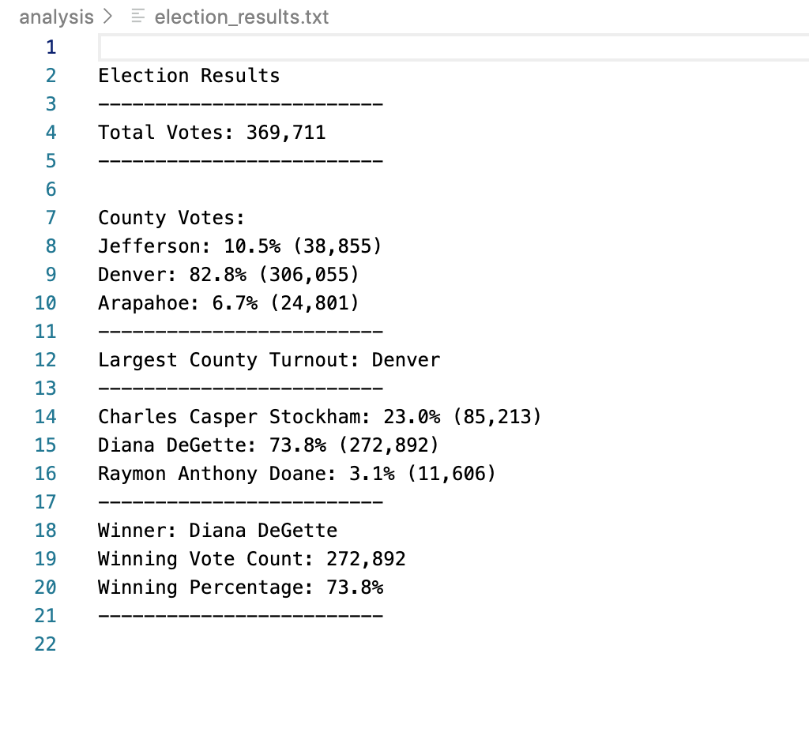

# Election Analysis

## Overview of Election Audit
Snapshot of Election Summary Report based on Seth & Tom's submission of election audit results requirement. 

### Purpose
The purpose of this analysis is to provide additional data to the election commission to complete the audit. The data includes: 
- The voter turnout for each county
- The percentage of votes from each county out of the total count
- The county with the highest turnout

## Election-Audit Results

### Analysis based on county 

As per the analysis Denver had the largest county votes. Please view:
- Total Votes: 369,711
- County Votes:
    - Jefferson: 10.5% (38,855)
    - Denver: 82.8% (306,055)
    - Arapahoe: 6.7% (24,801)

### Analysis based on candidate

As per the analysis Diana DeGette had the largest candidate votes. Please view:
- Total Votes: 369,711
- Candidate Votes:
    - Charles Casper Stockham: 23.0% (85,213)
    - Diana DeGette: 73.8% (272,892)
    - Raymon Anthony Doane: 3.1% (11,606)

## Election-Audit Summary

This explains the summary of the election audit analysis. In this particular analysis, the script was changed to get results for individual candidates and counties. In the future, this script can be used by other counties with their election analysis. The following variables could be changed to easily perform different election analysis:
- Name of the input file
- Name of the output/result file

